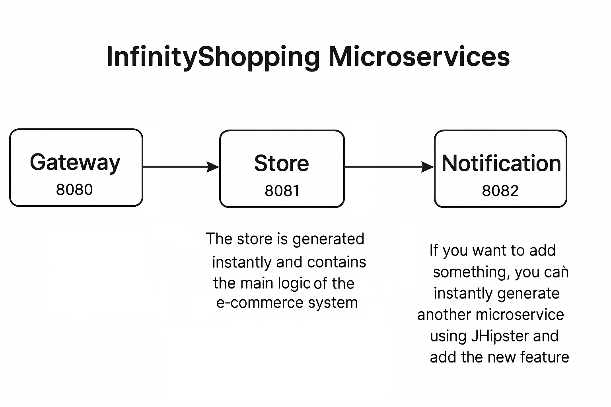
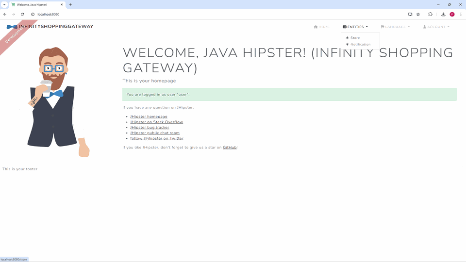

---

# InfinityShopping Microservices – Concept and Demo

This is the **microservices-based concept** of the [InfinityShopping](https://github.com/PiotrZielonka/infinityshopping) e-commerce shop generator, originally implemented as a **monolithic JHipster application**.

The purpose of this repository is to **learn and demonstrate microservices architecture** using **JHipster**, **Spring Boot**, and **Consul**, while offering a solid base for scaling the monolith into a full microservices solution.

> 🛠️ This is a **training and concept project**, not a production-ready application.
---

## 🚀 Project Goals

* Learn JHipster’s microservice architecture by **building from real generated code**.
* Compare service discovery strategies (Spring Cloud **Consul** vs **Eureka**).
* Demonstrate modern DevOps architecture using **Git submodules** for separation of concerns.

---

## ⚙️ Architecture Overview

| Service      | Port   | Description                          |
| ------------ | ------ | ------------------------------------ |
| Gateway      | `8080` | Front door, authentication & routing |
| Store        | `8081` | Basic e-commerce logic (CRUD)        |
| Notification | `8082` | Notification microservice (CRUD)     |
| Consul       | `8500` | Service registry & config server     |

All services are generated using JHipster and can be extended or regenerated using JHipster commands.

---

## 🗃️ Concept of InfinityShopping Microservices Architecture Diagram
This diagram illustrates the concept of InfinityShopping microservices:



---

## 🔄 Gateway Routing Demo

This GIF shows how the **Gateway at `localhost:8080`** dynamically routes requests to the **Store** and **Notification** microservices:


---

## 🧱 Microservices Strategy with Git Submodules

Each microservice is stored in its own Git repository and linked here as a **submodule**, allowing for independent development.

### How to use git in submodules:

#### ✅ The command below pulls all microservices at once:

```bash
git clone --recurse-submodules https://github.com/PiotrZielonka/infinityshopping-microservices-consul-product-concept.git
```

> ⚠️ This repository is **not meant for direct commits to microservices**. It’s a wrapper to bring submodules together. To make changes:

1. Go to the specific microservice repo (e.g.[infinityshopping-microservice-consul-store](https://github.com/PiotrZielonka/infinityshopping-microservice-consul-store))
2. Make your changes and commit there:
3. Return to this project and run:

  ```bash
  git submodule update --remote --merge https://github.com/PiotrZielonka/infinityshopping-microservice-consul-store.git
  ```

4. You can also transfer changes from all microservices at once run:
  ```bash
  git submodule update --remote --merge
  ```

---

## 🧪 Running the Application Locally

### Prerequisites

| Tool       | Version           |
| ---------- | ----------------- |
| Docker     | 28.0.4 (Desktop)  |
| Java       | OpenJDK 17        |
| Maven      | 3.8.1             |
| Node.js    | 22.15.1 (x64)     |
| PostgreSQL | Installed locally |

* This project has been tested with Docker Desktop version 28.0.4, but it should work with any newer release.
* Node.js 22.15.1 (x64) is verified to work, but other versions may also be compatible.
* “PostgreSQL must be installed locally for database setup and connection.

### Database Setup Instructions

> By default, JHipster configures PostgreSQL in Docker, but **this version connects to a locally installed PostgreSQL instance**.

To make sure you are running with the correct setup:

1. Start Docker (required for some JHipster containers, like Keycloak or registry).
2. **Delete any PostgreSQL Docker containers** after startup.

    * This avoids conflict since **local DB connection is used** (not Docker).
3. Make sure the local DB configuration matches these commits or configure database connection:

    * [Gateway DB Config](https://github.com/PiotrZielonka/infinityshopping-consul-gateway/commit/a78424f55258a30ed59372e8554d5ec19483e350)
    * [Store DB Config](https://github.com/PiotrZielonka/infinityshopping-microservice-consul-store/commit/064eeedfe9714114a2d8d5346ae7f895cb0fce06)
    * [Notification DB Config](https://github.com/PiotrZielonka/infinityshopping-microservice-consul-notification/commit/2c4cdfb871243390a84d6f67f35086b6013ebd5f)

### Launch

1. **Start the Gateway** (`localhost:8080`)
2. Start the Store (`localhost:8081`) and Notification (`localhost:8082`) microservices
3. Navigate to [http://localhost:8080](http://localhost:8080) to log in.
   Gateway will route requests to the microservices automatically.

---

## 🔭 Future Vision

The long-term vision is to enable developers to:

* Generate an entire e-commerce platform using **one command**
* Dynamically add microservices (e.g., `payment`, `review`, `inventory`) via JHipster
* Scale the project architecture from monolith to microservices on demand
* Use either Consul or Eureka depending on the environment

This is a **learning playground** but also a **powerful concept prototype** for real-world microservice systems.

---

## 🤝 Contributing

This is a personal training and demo project. Contributions are welcome, especially improvements or comparisons between service registries.

---

## 📫 Questions?

If you have questions or want to connect:

* Open an issue on this repository
* Check out the monolith version: [InfinityShopping Monolith](https://github.com/PiotrZielonka/infinityshopping)
* Explore each microservice from the submodules


Perfect! Here's the updated section for your `README.md` that includes the **Git submodule strategy** plus your new line for cloning everything in one command.

---

## 🧱 Microservices Strategy with Git Submodules

Each microservice (e.g., `gateway`, `store`, `notification`) is stored in its own Git repository and linked here as a **Git submodule**. This allows for modular development and easy team collaboration.

### Why use submodules?

* Teams can work independently on each microservice
* Each service has its own versioning and lifecycle
* Everything stays organized in one main project structure
* Mimics real-world CI/CD architecture

---

### 🧰 How to Use Git with Submodules

#### ✅ Clone the main project **with all submodules**:

```bash
git clone --recurse-submodules https://github.com/PiotrZielonka/infinityshopping-microservices-consul-product-concept.git
```

This command pulls all microservices (submodules) at once.

---

#### ✅ To update all submodules to their latest versions:

```bash
git submodule update --remote --merge
```

---

#### ✅ To update a single submodule:

Go into the submodule folder, make changes, commit and push:

```bash
cd infinityshopping-microservice-consul-store
git commit -am "Update store logic"
git push
```

Then return to the main repo and update the submodule pointer:

```bash
git submodule update --remote --merge
```

---

Would you like to include a visual diagram or file tree for how the submodules are structured in your project? It could make the concept even more clear for new developers.
